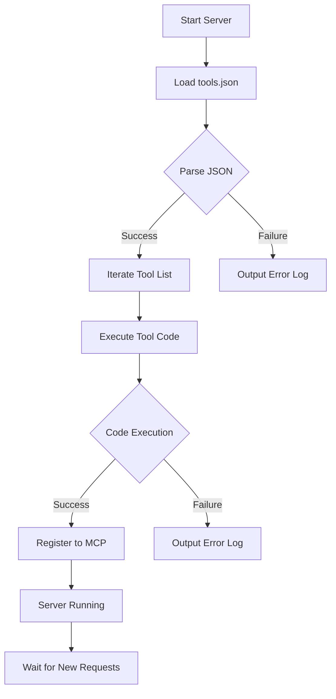

# MCP Hot Update Server Demo

<p align="center">
    <a href="./README_CN.md">中文文档</a> |
    <a href="https://deepwiki.com/whitejoce/hot-update-MCP-Server">DeepWiki for this Repository</a>
</p>

This is a hot update server example based on the FastMCP framework, allowing dynamic loading and updating of utility functions without restarting the server.

## Features

- Supports dynamic loading of utility functions
- Manage tools via JSON configuration files
- Real-time hot update capability
- Detailed error handling and logging

## Key Code
```python
exec(tool_code, globals(), local_namespace)
if inspect.isfunction(obj) and obj.__name__ in local_namespace:
     if found_func is not None:
          # Handle potential duplicate function definition if needed
          pass # Or log a warning, raise an error, etc.
     found_func = obj
if found_func:
     # Add the tool to MCP using the database name
     mcp.tool(
          name=tool_name, description=tool_description
     )(found_func)
     print(f"Successfully registered tool '{tool_name}'")
```

## 🚀 Quick Start

### 1️⃣ Environment Setup
Make sure you have **Python 3.7+** installed. Then, install the required library:

```bash
$ pip install fastmcp
```
*   `fastmcp`: Python implementation library for MCP.

### 2️⃣ Run MCP Server
```bash
$ python server.py
```

* The `tools.json` file format is as follows:
```json
[
     {
          "name": "Tool Name",
          "description": "Tool Description",
          "code": "def function_name(params):\n    # Function implementation\n    return result"
     }
]
```

## Security Notes

⚠️ **Important Security Warning**:
- The current implementation uses `exec()` to execute code read from the JSON file
- Additional security measures are required for production environments:
  - Code signature verification
  - Sandbox environment restrictions
  - Code review mechanisms
  - Access control

## Development Suggestions

1. Test all utility functions in the development environment
2. Ensure the JSON file format is correct
3. Add appropriate error handling
4. Implement a code review process
5. Consider adding version control mechanisms

## Workflow


