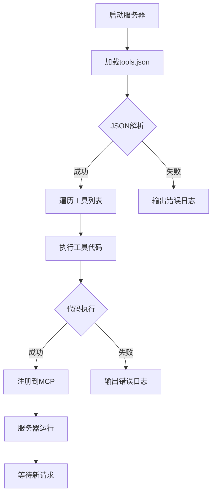

# MCP 热更新服务器Demo

这是一个基于FastMCP框架的热更新服务器示例，允许动态加载和更新工具函数而无需重启服务器。

## 功能特点

- 支持动态加载工具函数
- 通过JSON配置文件管理工具
- 实时热更新能力
- 详细的错误处理和日志记录

## 关键代码
``` python
exec(tool_code, globals(), local_namespace)
if inspect.isfunction(obj) and obj.__name__ in local_namespace:
    if found_func is not None:
        # Handle potential duplicate function definition if needed
        pass # Or log a warning, raise an error, etc.
    found_func = obj
if found_func:
    # Add the tool to MCP using the database name
    mcp.tool(
        name=tool_name, description=tool_description
    )(found_func)
    print(f"Successfully registered tool '{tool_name}'")
```

## 🚀 快速开始

### 1️⃣ 环境准备
确保你已安装 **Python 3.7+**。然后，安装必要的库：

```bash
$ pip install fastmcp
```
*   `fastmcp`: MCP 的 Python 实现库。

### 2️⃣ 运行 MCP Server
```bash
$ python server.py
```

* `tools.json`文件，格式如下：
```json
[
    {
        "name": "工具名称",
        "description": "工具描述",
        "code": "def 函数名(参数):\n    # 函数实现\n    return 结果"
    }
]
```

## 安全注意事项

⚠️ **重要安全警告**：
- 当前实现使用`exec()`执行从JSON文件中读取的代码
- 在生产环境中需要添加额外的安全措施：
  - 代码签名验证
  - 沙盒环境限制
  - 代码审核机制
  - 访问权限控制

## 开发建议

1. 在开发环境中测试所有工具函数
2. 确保JSON文件格式正确
3. 添加适当的错误处理
4. 实现代码审核流程
5. 考虑添加版本控制机制

## 工作流程

